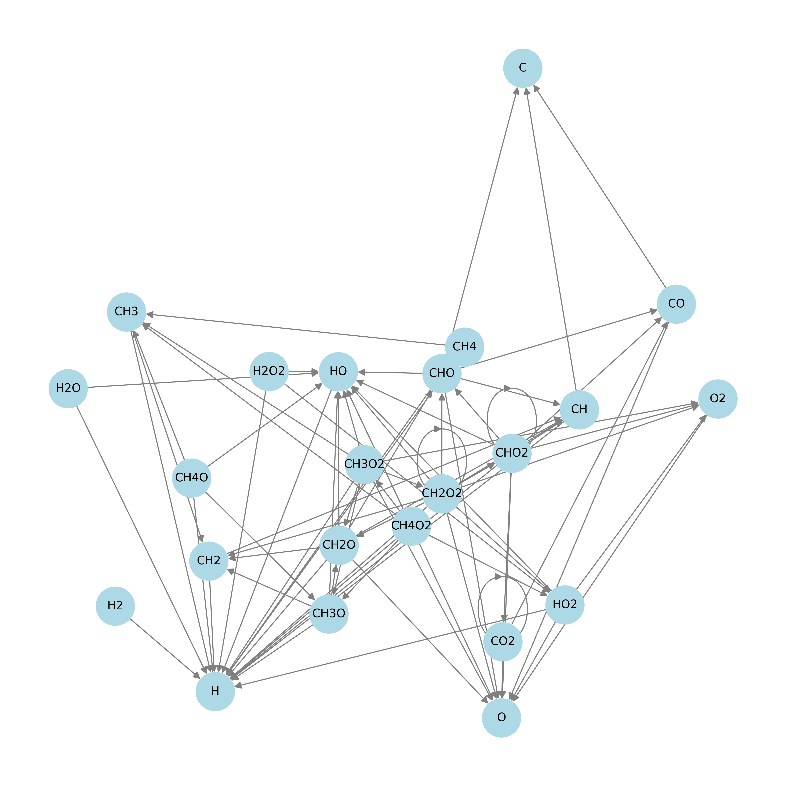

# ReactionNet-generator

Construct intermediates and reaction networks containing C, H, O elements (up to C6 products), and genegate adsorption configurations of these intermediates on metal surface.

## Table of Contents

- [0. Prerequisites](#0-prerequisites)
- [1. File Structure](#11-file-structure)
- [2. RNet.py](2-rnetpy)
  - [2.1 RNet.py Usage](#21-rnetpy-usage)
    - [2.1.1 Command-Line Arguments](#211-command-line-arguments)
    - [2.1.2 Example Command](#212-example-command)
  - [2.2 Outputs for RNet.py](#22-outputs-for-rnetpy)
- [3. MakeSlab.py](#3-makeslabpy)
  - [3.1 MakeSlab.py Usage](#31-makeslabpy-usage)
    - [3.1.1 Command-Line Arguments](#311-command-line-arguments)
    - [3.1.2 Example Command](#312-example-command)
  - [3.2 Outputs for RNet.py](#32-outputs-for-makeslabpy)
- [4. License](#4-license)
- [5. Acknowledgements](#5-acknowledgements)

## 0. Prerequisites

- RNet.py
  - Python 3 (version > 3.10)
  - NetworkX (A Python package for the creation of reaction networks.)
- MakeSlab.py
  - ASE (Atomic Simulation Environment, version > 3.22)
  - Pymatgen (Python Materials Genomics, version > 2023.3.23)
  - mp-api (The Materials Project API, version > 0.41.2)

## 1.1 File Structure

```
.
├── RNet.py # Genarate  reaction network diagram
├── MakeSlab.py # Construct all possible structures for intermediats adsorption on metal surfaces
├── utils
│ ├── molecule_db.py # Complete molecular library containing up to C6 products
│ ├── reaction_db.txt # Potential elementary reactions between molecules cataloged in the `molecule_db.py` file, where the first molecule acts as the reactant, and the second and third (if exist) molecules represent the products.
│ ├── id2chem.txt # The correspondence between molecular ID number and chemical formula
└ └── material_db.py # Metal database for cleaveving surfaces and adsorbing intermediates
```

## 2. RNet.py

RNet.py constructs a reaction network diagram containing all possible intermediate and elementary reactions based on the specified maximum number of C and O atoms.


## 2.1 RNet.py Usage

1. Ensure all prerequisites are installed and configured correctly.
2. Run the script with the desired parameters.

### 2.1.1 Command-Line Arguments

This script supports the following command-line arguments:

- noc（type=`int`): The maximum number of carbon atoms.
- noo（type=`int`): The maximum number of oxygen atoms.
- `--layout` (type: `str`, default: `spring`): The layout for the network graph, choose from "spring", "circular", "shell", "kamada_kawai", "spectral" or "random".

### 2.1.2 Example Command

To run the script, use the following command:

```sh
python script.py noc noo [--layout str]
```

```bash
python script.py 1 2 --layout spring
```

## 2.2 Outputs for RNet.py

1. `id2chem.txt` # The correspondence between molecular ID number and chemical formula
2. `molecule_db.py` # Selected molecular library
3. `reaction_db.txt` # Potential elementary reactions between molecules cataloged in the `molecule_db.py` file, where the first molecule acts as the reactant, and the second and third (if exist) molecules represent the products.
4. `material_db.py` # Metal database for cleaveving surfaces and adsorbing intermediates
5. `Reaction_Net.png` # Reaction network diaram.
## 3. MakeSlab.py

The MakeSlab.py script generates the configurations of molecules adsorbed on metal surfaces (POSCAR format of VASP) based on the molecular and elementary reaction database generated by `RNet.py`.

## 3.1 MakeSlab.py Usage

1. Ensure all prerequisites are installed and configured correctly.
2. Ensure `id2chem.txt`,`molecule_db.py`,`reaction_db.txt` and `material_db.py`  have been successfully generated by `RNet.py`.
3. Run the script with the desired parameters.

### 3.1.1 Command-Line Arguments

This script supports the following command-line arguments:

- `--plot` (type: `bool`, default: `False`): Enable plotting of top view of slabs and its adsorption sites
- `--api-key` (type: `str`): Materials Project API key.
- `--max-index` (type: `int`, default: `1`): Maximum Miller index to consider for slab generation.
- `--min-slab-size` (type: `float`, default: `8.0`): Minimum size of the slab.
- `--min-vacuum-size` (type: `float`, default: `15.0`): Minimum size of the vacuum layer.
- `--min-lw` (type: `float`, default: `10.0`): Minimum slab model a and b vector.
- `--distance` (type: `float`, default: `10.0`): Distance between adsorbate and slab.
- `--element` (type: `str`, default: `"Au"`): Chemical formula of the materials to process.
- `--max-slabs` (type: `int`, default: `None`): Maximum number of slabs to process per material.

### 3.1.2 Example Command

To run the script, use the following command:

```sh
python script_name.py  [--plot BOOL] [--api-key STR] [--max-index INT] [--min-slab-size FLOAT] [--min-vacuum-size FLOAT] [--min-lw FLOAT] [--distance FLOAT] [--element STR] [--max-slabs INT]
```

```sh
python MakeSlab.py --element Pt --max-index 1
```

## 3.2 Outputs for MakeSlab.py

[element][surface_index]_[molecule_ID]-[molecule_chemical_fomula].vasp
e.g. `Pt100_0-H2.vasp`

## 4. License

This project is licensed under the LGPL-3.0 License.

## 5. Acknowledgements

* ASE: [https://wiki.fysik.dtu.dk/ase/](https://wiki.fysik.dtu.dk/ase/)
* Pymatgen: [https://pymatgen.org/](https://pymatgen.org/)
* NetworkX: [https://networkx.org/](https://networkx.org/)

