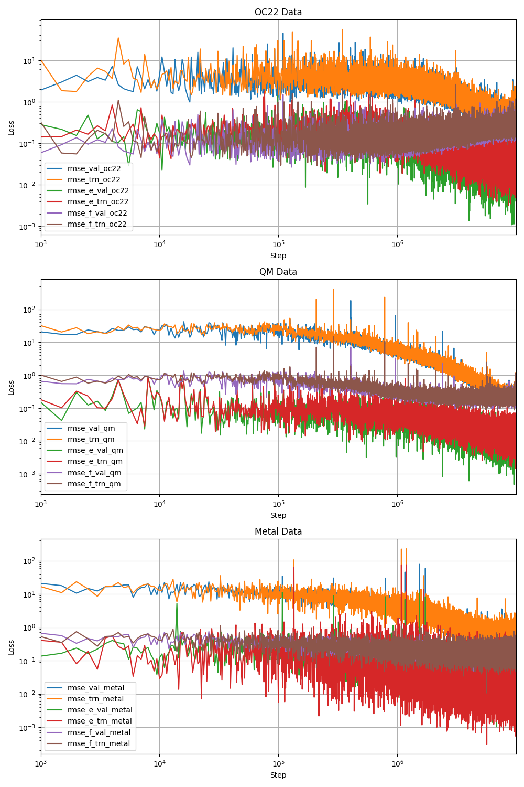

# Training input files, configurations and checkpoints by DPA1 and Gemnet-OC
## Table of Contents

1. [Training input files and model by DPA1 and Gemnet-OC](#training-input-files-and-model-by-dpa1-and-gemnet-oc)
   - [0. CLAM dataset (version: 2024Q2)](#0-clam-dataset-version-2024q2)
   - [1. Training model](#1-training-model)
     - [1.1 Training by DPA in DeePMD-kit](#11-training-by-dpa-in-deepmd-kit)
     - [1.2 Training by Gemnet-OC](#12-training-by-gemnet-oc)
   - [2. Finetune model](#2-finetune-model)
     - [2.1 Finetune by DPA in DeePMD-kit](#21-finetune-by-dpa-in-deepmd-kit)
     - [2.2 Finetune by Gemnet-OC](#22-finetune-by-gemnet-oc)
   - [3. Checkpoints and configurations](#3-checkpoints-and-configurations)
   - [4. Test Results](#4-test-results)

## 0. CLAM dataset (version: 2024Q2)

All bulk, slab, and molecules dataset are obtained by AIMD simulations and labeled per 10 steps. The initial structures are discussed in [README.md](../generation/README.md)

|                       |  bulk   |  slab   |  molecules       |  oc22      |
| --------------------- | ------- | ------- | ---------------- | ---------- |
|  Training dataset     |  46254  |  81616  |  2146176         |  ~6640000  |
|  Validation dataset   |  5154   |  9081   |  238464          |  ~660000   |

## 1. Training model

### 1.1 Training by DPA in DeePMD-kit

The example input file: [input.json](./dpa1/input.json). Run the training job by:

```sh
dp --pt train input.json --skip-neighbor-stat > out
```

or restart the training jobs by:

```sh
dp --pt  train input.json --skip-neighbor-stat --restart  model.ckpt.pt > out
```
The training error and validation error:



### 1.2 training by Gemnet-oc

the example input file: [finetune1.yml](./gemnet-oc/finetune1.yml). Run the training job by:

```sh
python main.py --mode train --config-yml finetune1.yml --print-every 1000 >> out
```

or restart the training jobs by:

```sh
python main.py --mode train --config-yml finetune1.yml --checkpoint ./checkpoints/2024-08-01-15-21-36/checkpoint.pt --print-every 1000 >> out
```

## 2. finetune model

### 2.1 finetune by DPA in DeePMD-kit

Example of finetune based on pretrained `model.ckpt-10000000.pt`, note that `--model-branch` is needed to specify the task head.

```sh
dp --pt train finetune1.json --finetune ./model.ckpt-10000000.pt --model-branch bulk > finetune.out
```

### 2.2 finetune by Gemnet-oc

Example of finetune based on OC pretrained `gnoc_oc22_oc20_all_s2ef.pt`, and if you want to finetune the model from your self-made checkpoint, the `epoch`, `steps` information need to be removed by the [script](../scripts/sim_model.py).

```sh
python main.py --mode train --config-yml finetune1.yml --checkpoint gnoc_oc22_oc20_all_s2ef.pt --print-every 1000 >> out
```

## 3. Checkpoints and configurations

The pretrained configurations and checkpoints by Gemnet-OC can be found [here](https://fair-chem.github.io/core/model_checkpoints.html). Our finetuned configurations based on the CLAM dataset will be coming soon.

The pretrained configurations and checkpoints by DPA1 based on our CLAM dataset and OC22 can be found [here](./dpa1/).

## 4. Test Results

Performance of the trained model on the test dataset by DPA1:

| DPA1 Test Data Size       | 8420  | 2043      | 26000  |
| --------------------------- | ------- | ----------- | -------- |
|                           | OC22  | Bulk+Slab | qm     |
| **E**mae (eV)       | 1.65  | 2.08      | 0.172  |
| **E**mae/atom (meV) | 21.2  | 19.9      | 11.9   |
| **F**mae (eV/Å)    | 0.131 | 0.112     | 0.0982 |

Performance of the trained model on the test dataset by Gemnet-OC:

| Gemnet-OC Test Data Size | 5154+9081+132480 = 146715 |
| -------------------------- | --------------------------- |
|                          | Bulk+Slab+qm              |
| **E**mae (eV)      | 0.048                     |
| **F**mae (eV/Å)   | 0.016                     |
