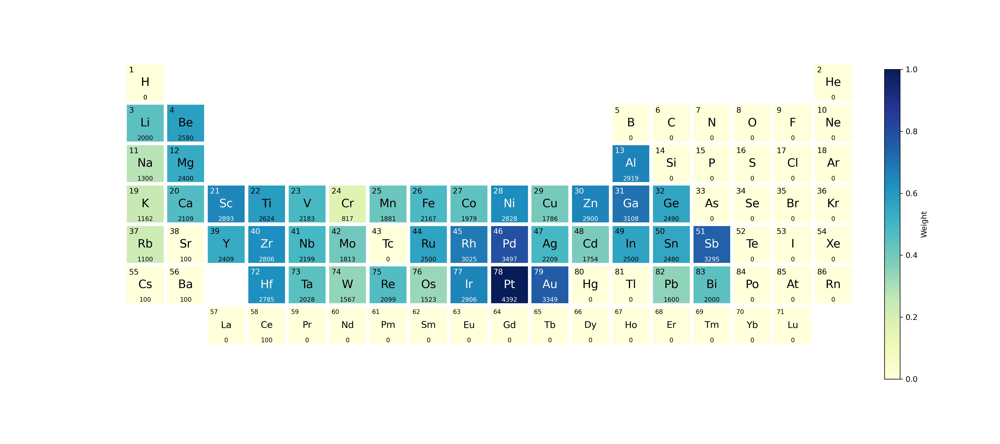

# VASP Calculation Workflow Manager

This project provides a script to manage VASP calculations for optimizing atomic structures (OPT), running molecular dynamics (MD), and processing results into datasets for machine learning purposes. The script supports submitting VASP jobs, checking SCF convergence, running MD simulations, and converting data for DeepMD or Graph Neural Network training. Additionally, it includes functionality for visualizing the occurrence of elements in the dataset.


## Table of Contents

1. [Prerequisites](#prerequisites)
2. [File Structure](#file-structure)
3. [Usage](#usage)
   1. [Command-Line Arguments](#command-line-arguments)
   2. [Example Command](#example-command)
   3. [Input File](#input-file)
4. [Workflow Description](#workflow-description)
5. [Detailed Instructions](#detailed-instructions)
   1. [Prepare the Environment](#1-prepare-the-environment)
   2. [Set Up Input Parameters](#2-set-up-input-parameters)
   3. [Run the Script](#3-run-the-script)
   4. [Check Job Status](#4-check-job-status)
   5. [Process Data](#5-process-data)
   6. [Plot Element Weights](#6-plot-element-weights)
6. [Notes](#notes)
7. [License](#license)
8. [Acknowledgements](#acknowledgements)

## Prerequisites

- Python 3 (version &gt; 3.10)
- ASE (version &gt; 3.22)
- DeepMD-kit (version &gt; 3.0.0a1)
- dpdata (version &gt; 0.2.18)
- VASP and VASPkit
- SLURM (for job scheduling)
- tqdm (version &gt; 4.65.0，for progress bars)
  
  if output lmdb dataset need:
- torch (version &gt; 2.3.1)
- torch_geometric
- torch_scatter
- lmdb (version &gt; 1.5.1)
- fairchem

## File Structure

```
├── flow.py # Main script for managing VASP calculations
├── input # File containing input parameters
├── utils
│ ├── plot_weight.py # Script for plotting element weights
│ ├── INCAR_opt # INCAR file for optimization
│ ├── INCAR_md # INCAR file for molecular dynamics
│ ├── KPOINTS # VASP k-points file
│ └── sub.vasp # VASP submission script
└── structure_db # Directory contains POSCAR-xxx files
```

## Usage

### Command-Line Arguments

- `prefix`: Prefix for files to process. usually POSCAR
- `operation`: Specify the operation to perform. Choices are:
  - `opt`: Submit VASP optimization jobs.
  - `md`: Submit VASP MD jobs.
  - `optcheck`: Check SCF convergence for OPT jobs.
  - `mdcheck`: Check SCF convergence for MD jobs.
  - `dpdata`: Process data into npy or lmdb format for DeepMD training.
  - `plot`: Plot element weights in the dataset.

### Example Command

```bash
python vasp_manager.py PREFIX opt
```

### Input File

The script reads parameters from an `input` file in the same directory. The file should contain the following parameters:

```
work_path: /path/to/work/
opt_INCAR_path: /path/to/work/utils/INCAR_opt
md_INCAR_path: /path/to/work/utils/INCAR_md
vasp_sub_path: /path/to/work/utils/sub.vasp
structre_db_path: /path/to/work/structure_db/
max_jobs: 25 # max jobs in slurm queue
sleep_time: 20 # the interval time for jobs checking in slurm queue 
user_name: your_username
step_data: 10 # Interval of data extraction by dpdata
test_size: 0.1 # Proportion of test dataset
dataset_prefix: /path/to/work/data
dataset_fmt: npy_single # or npy_mix or lmdb
plot_name: element_weights.png
```

### Workflow Description

1. **VASP OPT Batch Submission** :
   * Submits VASP optimization jobs in batch.
   * The initial optimization doesn't require full structural convergence, only SCF convergence.
2. **Check SCF Convergence for OPT** :
   * Checks SCF convergence for VASP optimization jobs.
3. **Run AIMD Simulations** :
   * Runs ab initio molecular dynamics simulations based on SCF-converged OPT results to generate data for collection
4. **Check SCF Convergence for AIMD** :
   * Checks SCF convergence for MD simulations and logs the number of SCF-converged steps.
5. **Process Data for DeepMD Training** :
   * Converts VASP results into npy or lmdb format for training neural network potentials. Note that only AIMD data are collected by an interval
6. **Plot Element Weights** :
   * Plots the occurrence of elements in the dataset as a colored periodic table.

## Detailed Instructions

### 1. Prepare the Environment

Ensure all prerequisites are installed and properly configured.

### 2. Set Up Input Parameters

Create an `input` file in the project directory with the required parameters.

### 3. Run the Script

Use the command-line interface to perform various operations. For example, to submit optimization jobs, use:

```
python vasp_manager.py POSCAR opt
```

'POSCAR' is the PREFIX of the structure name in structure_db.

If numer of your POSCARs in structure_db is large, usually you need to run this manuscript by nohup

```
nohup python vasp_manager.py POSCAR opt &
```

after opt and optcheck, the aimd jobs are submited

```
nohup python vasp_manager.py POSCAR md &
```

### 4. Check Job Status

Use `optcheck` or`mdcheck` operations to verify SCF convergence for OPT and MD jobs, respectively.

```
python vasp_manager.py POSCAR optcheck
python vasp_manager.py POSCAR mdcheck
```

### 5. Process Data

After completing the VASP simulations, convert the results into a suitable format for machine learning:

```
python vasp_manager.py POSCAR dpdata 
```

change the `dataset_prefix: /path/to/work/data` and `dataset_fmt: npy_single # or npy_mix or lmdb` parameters to control which format to output.


### 6. Plot Element Weights

Visualize the occurrence of elements in your dataset:
```
python vasp_manager.py POSCAR plot
```


## Notes

* Ensure the VASP, vaspkit and DeepMD-kit executables are accessible in your environment.
* Customize the `INCAR_OPT`, `INCAR_MD`, `KPOINTS`, and submission scripts (`sub.vasp`) as needed for your specific system and requirements.

## License

This project is licensed under the GNU General Public License v3.0. See the [LICENSE](LICENSE) file for details.

## Acknowledgements

* ASE: [https://wiki.fysik.dtu.dk/ase/]()
* VASP: [https://www.vasp.at/](https://www.vasp.at/)
* DeepMD-kit: [https://github.com/deepmodeling/deepmd-kit](https://github.com/deepmodeling/deepmd-kit)
* dpdata: [https://github.com/deepmodeling/dpdata](https://github.com/deepmodeling/dpdata)
* VASPkit: [https://vaspkit.com/](https://vaspkit.com/)
* fairchem: [https://github.com/FAIR-Chem/fairchem](https://github.com/FAIR-Chem/fairchem)
* SLURM: [https://slurm.schedmd.com/]()
